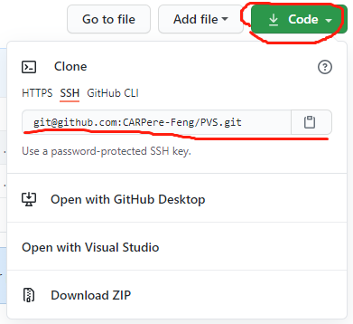
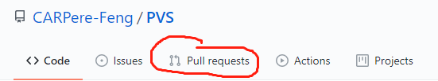

# Basic_Git_Operation
Serving for those who are new to Git and Github, these docs are going to tell you how to realize some basic git operations.

## Some Necessary Terminologies
* __Git__: A tool to manage your file changing. It is a tool like chrome, when you click chrome, you open a window, however, when you click git, you do somthing to your files. 
* __Github__: A website that can be used as a cloud storage, just like storage of your computer but it is an online storage.
* __Repo__: Repo means repository. A repo is a folder you collect your project codes in.
* __Local Repo__: Codes folder in your computer. We call it local because it is in your computer.
* __Remote Repo__:  Codes folder in server( like Github). We call it remote because it is not in your computer.

## Download Git
To work well under visual studio using git and github, both of the following two are needed to be installed.
### Windows
Search Git on google and download it.
### Windows: Visual Studio2019
Open Visual Studio 2019. Go to `Extensions > Manage Extensions > search for Github Extension for Visual Studio`.

## Solutions
As git extensions are similar to basic git command, listed solutions are going to using git command.

Questions are :  (for a new coder, follow the sequence and you will satisfy the need for pull request)
1. [How to create your own remote repo from another remote repo?](#jump1)
2. [How to clone your remote repo for creating a new local repo?](#jump2)
3. [Check out your own branch](#jump8)
4. [After modifying codes, how to push your code to your remote repo?](#jump3)
5. [If pushing failed, how to config your user setting?](#jump5)
6. [How to pull codes from remote repo to local repo?](#jump4)
7. [If pulling failed, how to tackle with conflicts?](#jump6)
8. [CODES COLLABORATION, how to contribute to the main branch: Pull Request](#jump7)
9. [How to merge branches?](#jump9)
10. [想跟进他人的remote repo，pull最新代码，如何设置upstream?](#jump20)

******

#### <span id="jump1">1. How to create your own remote repo from another remote repo?</span>
Click into the github repository, like below. Then choose`Fork`.    


You can find that there is a repo with the same name in your github. As that repo is in your github, any changes will not affect the repo you forked from.

#### <span id="jump2">2. How to clone your remote repo for creating a new local repo?</span>

Now you should have a remote repo in your own github, then you need to clone it to your computer( local repo).

Firstly, open your remote repo and copy the url like below


Then, go to the folder you want to clone to. If you have installed Git, right click in the folder and choose `git bash`. A terminal will open so that type commands `git clone` to clone the remote repo to local:
```
$ git clone git@github.com:CARPere-Feng/PVS.git
Cloning into 'gitskills'...
remote: Counting objects: 3, done.
remote: Total 3 (delta 0), reused 0 (delta 0), pack-reused 3
Receiving objects: 100% (3/3), done.
```

At this step, you probably need to get an ssh key for your computer. Please follow [this github tutorial](https://docs.github.com/en/github/authenticating-to-github/connecting-to-github-with-ssh) to generate a key.

After cloning, you can modify codes in this local repo.

至此，你已经有了自己的local repo, 自己的remote repo。但是，如果在你写代码时，你`fork`的他人remote repo有新的代码更新，你还无法将他人的remote repo代码`pull`到自己的local repo。因此，在完成这一步之后，建议继续完成[这一步](#jump20)，从而能够跟进他人remote repo的最新代码。
#### <span id="jump8">3. Check out your own branch</span>

__branch__: A repo is like a tree. There can be many different versions, which are called branch.

Mostly, `master` branch is a stable version of this repo. `dev` branch is an unstable version of this repo.

As your are doing many kinds of trails on the repo, you should `checkout` your own branch:
```
/// switch to dev branch and create your own xxx branch from dev branch
$ git switch dev
$ git checkout -b xxx
```

See which branch you are at, now:
```
$ git status
```

#### <span id="jump3">4. After modifying codes, how to push your code to your remote repo?</span>

-----------
###### what is COMMIT and PUSH?
You will need to commit your changes before push your codes. __By commit changes__, you update your local repo with your modification of codes. __By push codes__, you update your remote repo with your local repo.

-----------
Assume now that you have changed some codes in your local repo, you need to tell git that these changes can be recorded, so you `commit` changes. Before `commit`, we need to `add` changes:

```
$ git status
$ git add *
$ git status
```

Then, `commit` the added changes:

```
$ git commit -m "these place is for notes"
```

After `commit`, you can check the repo status:
```
$ git status
```

Now, you have updated local repo with your changes. Next step is update remote repo. We call it `push`:
```
/// the command below means push local branch, master and dev, to remote repo.
$ git push origin master dev
```

#### <span id="jump5">5. If pushing failed, how to config your user setting?</span>


#### <span id="jump4">6. How to pull codes from remote repo to local repo?</span>

For a collaboration repository, update your local repo with remote repo is necessary.

So you should `pull` codes from remote repo before starting working:
```
$ git pull
```
By pulling, you update your local repo with new changes of remote repo.

#### <span id="jump6">7. If pulling failed, how to tackle with conflicts?</span>
#### <span id="jump7">8. CODES COLLABORATION, how to contribute to the main branch: Pull Request</span>

In github webpage, you can push your codes in your remote repo to others' remote repo:


#### <span id="jump9">9. How to merge branches?</span>

When you fixed a bug or stabilized your own branch, you will need to merge your branch to a main branch. For example, you have checked out a new branch of your own, `xxx`, and have already finished changing. You should merge `xxx` branch to `dev`, so that you can make a `pull request`.

Here, we assume you are at branch `xxx`, and want to merge `xxx` with `dev`:
```
$ git switch dev
$ git merge xxx
```
By this step, your codes on `dev` branch should be the same as `xxx` branch.

#### <span id="jump20"> 10. 想跟进他人的remote repo，pull最新代码，如何设置upstream? </span>

```
// 进入local repo文件夹
$ git remote set-url origin git@github.com:[your github user name]/drake.git
$ git remote add upstream git@github.com:[others github user name]/drake.git
$ git remote set-url --push upstream no_push
```

上述操作，将设置两个remote repo source。`origin`指向你`fork`出来的自己的remote repo，`upstream`指向他人的remote repo，并将他人的remote repo设置为`no_push`。  

至此，你可以从他人的remote repo `pull` 代码到你的local repo，同时也能`pull`自己remote repo的代码到你的local repo，并`push`自己的local repo到自己的remote repo(如同前面教的一样)。

```
/// pull 他人代码到自己local repo，从而跟进最新代码
$ git pull upstream master dev

/// push 自己代码到自己local repo
$ git push origin master dev xxx
```
这里的`master dev xxx`是`branch`的名称。